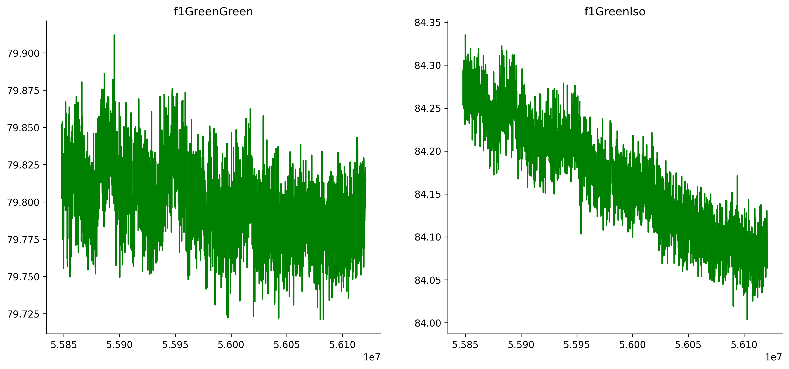

# Donaldson Lab Fiberphotometry Analysis
> This software is for performing analysis on animal fiberphotemetry and behavior data 

In order to use this code you must have collected fiberphotometry data using `Bonsai` and behavior data using the behavior coding software `BORIS` (https://boris.readthedocs.io/en/latest/#behavioral-observation-research-interactive-software-boris-user-guide). 

### Note: this software is currenlty optimized for GcAMP (or other green fluoraphores)


## Installation

Open a terminal and navigate to the working directory where you would like to store and use this software. Run the following command to download the code from this repository into that directory. 

```sh
git clone https://github.com/anmc9115/swe4s_final_project_am_cp_js.git
```

## To Use the Code
1. Obtain fiberphotometry data `msec/day`
2. If analyzing behavior, score behavior using BORIS with the events recorded in `seconds`
3. If analyzing behavior, download raw data from behavior scoring using BORIS by clicking: `observations -> export events -> tabular events -> select observations -> save as csv`
4. Download all analysis software as described in the `Installation` section above
5. Open and edit the `config.yml` file with the parameters specific to your experiment. You will need to edit this file each time you want to run the code.
6. In the command line, run the following command to execute the code:
      `python fpho_config.py --config config.yml`
7. A summary excel file along with any plots from analysis will be output to the working directory.

## Example Plots
### Raw Signal Trace
<center></center>

### Normalized Signal to Isosbestic
<center></center>

### Normalized Signal to Biexponential Fit
<center></center>

## Release History

* v2.0
    * ADD: `fpho_setup.py` library that parses fpho data, contains analysis
    * ADD: functional and unit testing: `fpho_ftest_driver.py`, `fpho_driver.py`, `ftests_fpho_setup.txt`, `test_fpho_driver.sh`, `test_fpho_setup.py`, `unittest_fpho_setup.py`
    * ADD: `behavior_setup.py` library that parses behavior data, contains analysis
    * ADD: `config.yml` file manipulated by user to run the software
    * ADD: Example plots, sample and test data
